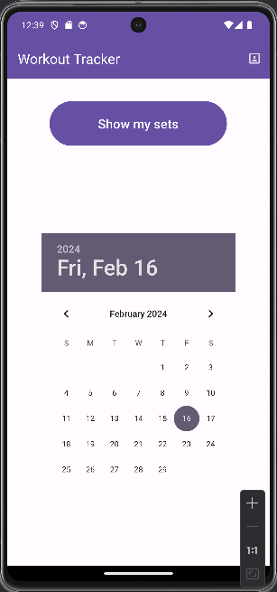
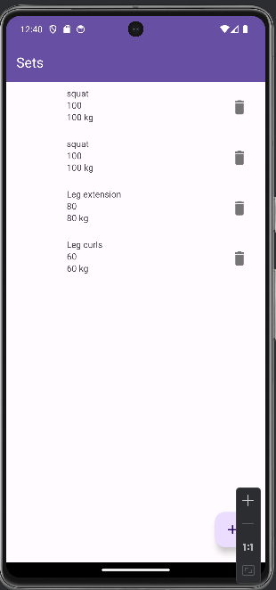
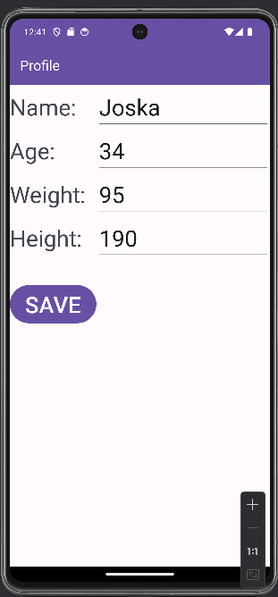

## Description

Ez egy kotlin nyelven íródott alklamazás Android pltaformra. Egy Edzőtermi edzés követő alkalmazást készítettem különböző Androidfejlesztési technológiák felhasználásával.

## Bemutatás
Ez egy olyan alkalmazás, amelyben el lehet tárolni egy konditermi edzést. Edzésnapra lebontva, az adott napi gyakorlatok, a hozzájuk tartozó sorozat és ismétlésszám, valamint a használt súly mennyisége. Az ötlet önnét született, hogy én is járok edzeni és hasznosnak találnék egy ilyen alkalmazást. Az alkalmazás célközönsége minden olyan sportoló, aki rendszerezné és tárolná a nyomonkövethetőség érdekében a teljesítményeit.

## Főbb funkciók
Az alkalmazás elindításakor egy főképernyő fogad, amelynek két része van. Felül beléphetünk A személyes profilba, ahol megadhatjuk a saját adatainkat mint pl.: név, születési idő, súly, magasság és egyéb egészségügyi adatok. Ez alatt a főképernyőn egy naptár található, ahol kijelölhető, melyik napra akarunk gyakorlatokat felvinni, vagy melyik már elvégzett nap gyakorlatait akarjuk visszanézni. Ezután a kiválasztott napon egy Recycle view segítségével egy perzisztens adatbázisból megkapja a felhasználó az aznapi tárolt gyakorlatait, melyhez a plusz gombra nyomva egy dialógusablakban újabb sorozatot adhat hozzá. Az ablakokat fragment technológiával tervezem megoldani. A hibásan felvitt sorozatot egy törlés gombbal bármikot eltávolíthatjuk.

## Választott technológiák:
1. UI
2. fragmentek
3. RecyclerView
4. Perzisztens adattárolás: Room, Shared Preferencies

## Screenshots

### Főképernyő

### Napi edzés felvitele

:::info
A napi edzésnél megadható a gyakorlat neve, az ismétlések száma és a használt súly.
:::
:::warning fontos
Az edzésmunkát settenként kell felvinni!
:::

### Felhasználói profil
