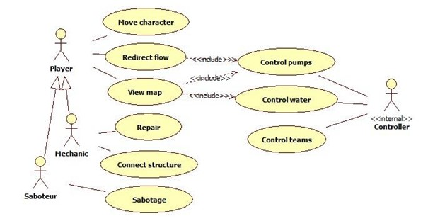
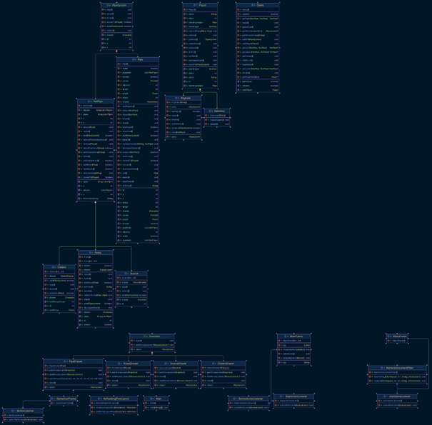

## Description

A szoftver egy két csapatból álló stratégiai játék, ahol az egyik csapat feladata a víz eljuttatása a végcélba, míg a másik csapat célja ennek megakadályozása.
Első körben egy vázat készítünk el, amely a készülő program alapvető kapcsolatait és felépítését szemlélteti.
Ezután egy már játszható, de még nem teljes változat készül el.
Végül a grafikus megjelenítés és a teljes játék valósul meg.

## Use-Case

## Class Diagram

## Installation

`javac *.java` kóddal tudjuk lefordítani a kódot, ezt a parancsot a projekt mappán belül kell kiadni.

## How to run

`java Main` paranccsal tudjuk futtatni a kódot, abban a mappában, ahol fordítottuk a
kódot.

## Folders

|Folder(s)/File(s)|about|
|-|-|
|javadoc|A project Javadoc dokumentációja|
|src|A projekt maga|
|Dokumentáció.pdf|A végső dokumentáció|