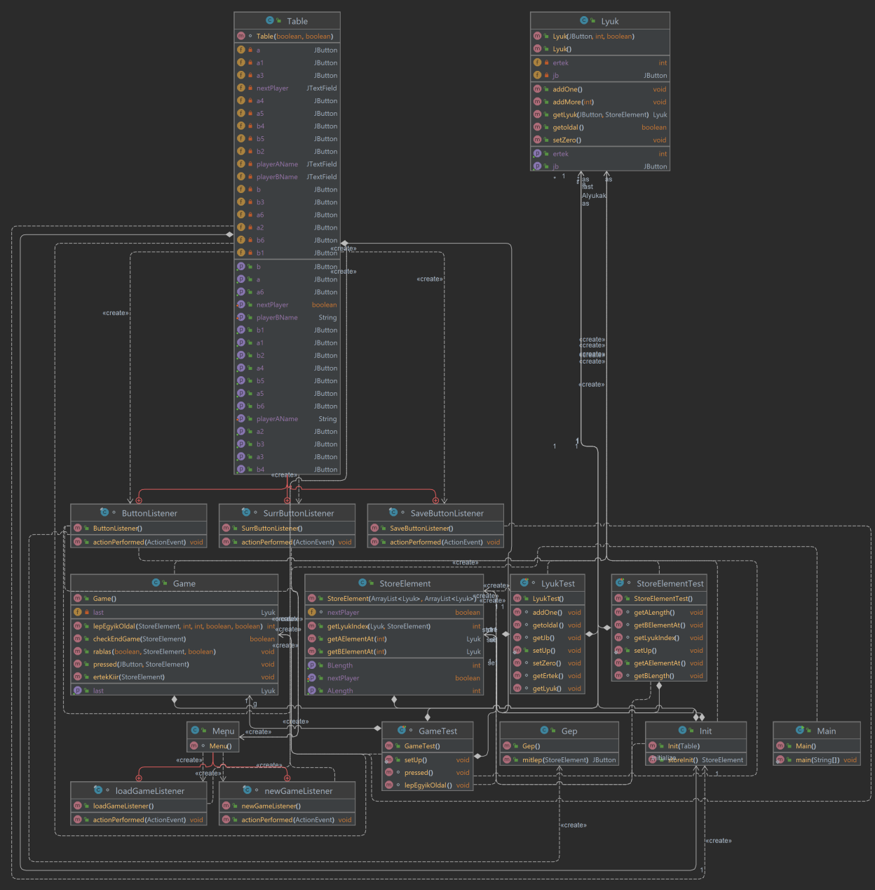
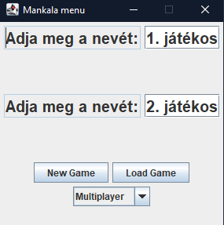
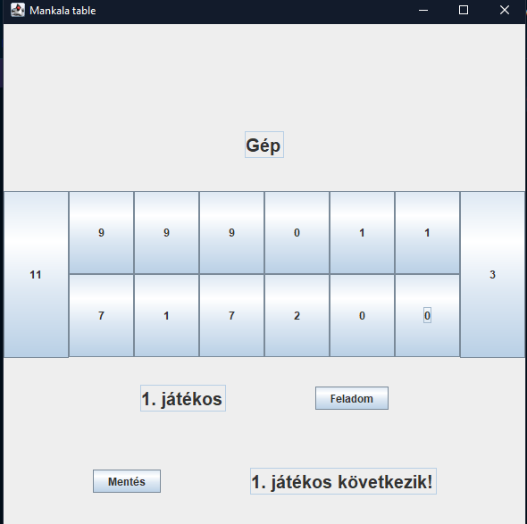

## Description

A mancala egy gyűjtőnév, amely a kétszemélyes táblajátékok egy családját foglalja magába. A mancala hasonló szerepet tölt be afrikai és ázsiai országokban, mint Európában a sakk. Ennek a családnak egy specifikus szabály alapú implementációját valósítok meg. A játéktábla egy 2x8-as mátrixként vehető, melyben az első és az utolsó oszlop egy lyukként felfogható, valamint minden másik oszlop 1-1 sora is egy-egy lyukként tekinthető, így összesen 12 egy cellás és 2 2 cellát is magába foglaló lyukból áll a tábla.

## Implementation

A játékot én Java nyelven implementáltam és a grafikus megjelenítéshez java swinget használtam.

## Class Diagram

## User manual

Elindításkor megjelenik a menü, melyben beállítható a két játékos neve. A New Game segítségével új játékot indíthatunk, míg a Load Game-el e legutóbb mentett játékállást folytathatjuk. A menü alján beállíthatjuk, hogy a gép ellen szeretnénk játszani, vagy egyedül. A játék elindultával a menü bezáródik és megnyílik a játéktábla. Az alsó sorban elhelyezkedő nevű játékos kezd. Ő a szabályoknak megfelelően lyukat amelyikből a köveket vetni szeretné a megadott gombra kattintva választhatja ki. Ezután megtörténik a lépés, amely látszódik a játéktáblán és a másik játékos következik, ami a képernyő alján látható is. Amennyiben a gép ellen játszunk, a saját lépésünk után közvetlenül megtörténik a gép lépése is, így nem kell várni rá, hogy gondolkodjon. A feladás gombra kattintva a játék véget ér és az ellenfél játékos győz. Amennyiben a játék véget ér valakinek a győzelmével, a program kiírja a győztest, majd ezt leokézva újra a főmenübe jutunk, ahonnét új játékot indíthatunk. Játék közben az

## Screenshots

### Menu screen

:::note
A játék játszható ketten egymás ellen vagy egyedül gép ellen is.
:::

### Game

:::note
A tábla gombokból épül fel, melyekből a megfelelőre kattintva választhatjuk ki, hogy melyikből kerüljenek ki a kövek.
:::

## Projects Content

|Folder(s)/File(s)|about|
|-|-|
|mankala|A projekt java filejai|
|Dokumentáció.pdf|A végső dokumentáció|