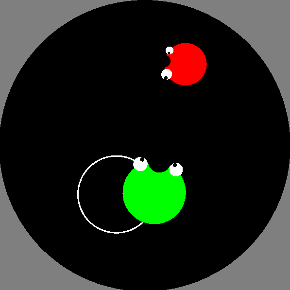
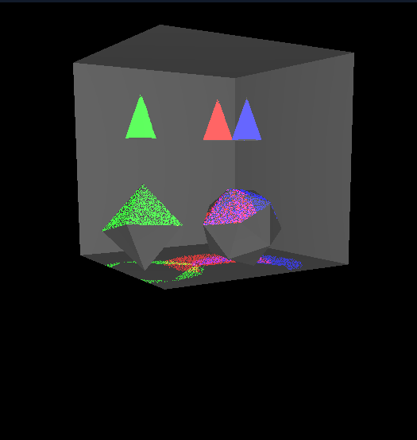

## Description

Ez két c++ nyelven íródott OpenGL projektet tartalmaz. Az első egy hiperbólikus geometrián játszódó egyszerű játék, míg a második egy sugárkövetéssel megvalósuló szoba. Az openGL-hez a freeglut és a glew könyvtárakat használtam.

import Tabs from '@theme/Tabs';
import TabItem from '@theme/TabItem';

<Tabs>
<TabItem value="hiperbol" label="Hiperbólikus játék" default>

## Description

A projektben két kör alakú hami mozog a hiperbólikus síkon és próbálják megenni egymást. A hamik szeme mindig a másik hamira néznek.

## Screnshots

</TabItem>

<TabItem value="raytrace" label="Sugárkövetés">

## Description

A projektben 3 különböző színű kúp lámpa világítja meg a szobát, amelyek egérkattintásal áthelyezhetők.

## Screnshots

</TabItem>
</Tabs>