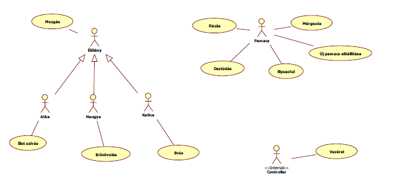
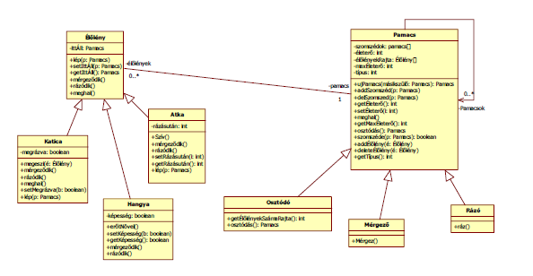
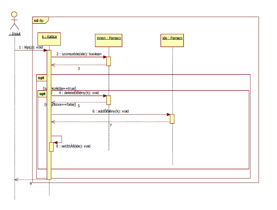

## Description

A projektben egy játék feladatleírása alapján kellett megtervezni, specifikálni és dokumentálni egy komplex szoftvert.

## Task

A Szaturnusz légkörében különböző fajtájú pamacsok lebegnek egymással összekapcsolódva, kolóniát alkotva. Ha két szomszédos pamacs egyforma fajtájú, akkor néha egy új pamacsot állítanak elő, amelynek fajtája teljesen véletlenszerű, és nem feltétlenül egyezik meg egyik szülő fajtájával sem. Az új pamacsnak kezdetben csak a szülei a szomszédjai, a szülők szomszédossága pedig megszűnik. A pamacsoknak bármennyi szomszédja lehet. A pamacsokon különböző élőlények élnek, amelyek a pamacsokon tudnak mozogni. Vannak atkák, amelyek kiszívják a pamacsok erejét. Ha egy pamacs ereje elfogy, a pamacs elpusztul, a pamacs szomszédjai összekapcsolódnak, az addig a pamacson álló élőlények a szomszéd pamacsokra kerülnek. Vannak hangyák, amelyek meg tudják növelni egy pamacs erejét, de ha egy pamacs túltöltődik, a pamacs osztódik, a két új pamacs egymás szomszédja lesz, az eredeti szomszédokat pedig egymás közt szétosztva megöröklik. Vannak katicák, amelyek a velük egy pamacson álló atkákat és hangyákat tudják megenni. A pamacsokon általában akármennyi élőlény állhat. Van olyan fajta pamacs, amelyik spontán osztódik, ha a rajta lévő élőlények száma meghaladja az 5-öt. Van olyan pamacsfajta, amelyik a rálépő lényeket megmérgezi. Ettől az atka elpusztul, a hangya elveszíti a pamacserő-növelő képességét. Van olyan pamacs, ami véletlenszerűen a rajta álló lényeket megrázza. Ettől az atka 5 pamacson kell átlépjen ahhoz, hogy újra képes legyen erőt szívni. A hangyát a rázás nem zavarja. A katicák a méregre immunisak, a rázástól viszont megbénulnak, amíg újabb rázás nem éri őket. A játékosok feladata a katicák irányítása. A játék célja, hogy minél nagyobb pamacskolónia jöjjön létre

## Use-case diagram

## Class diagram

## A complex sequentional diagram

